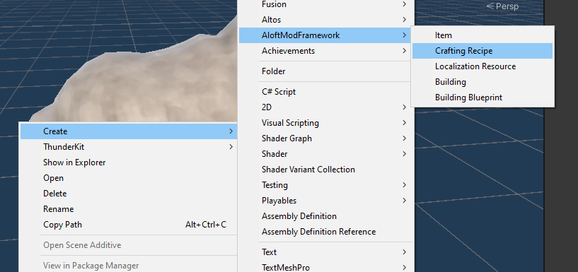
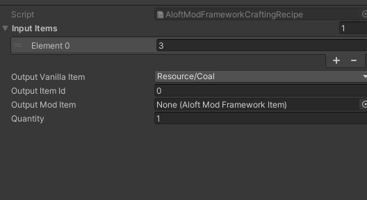
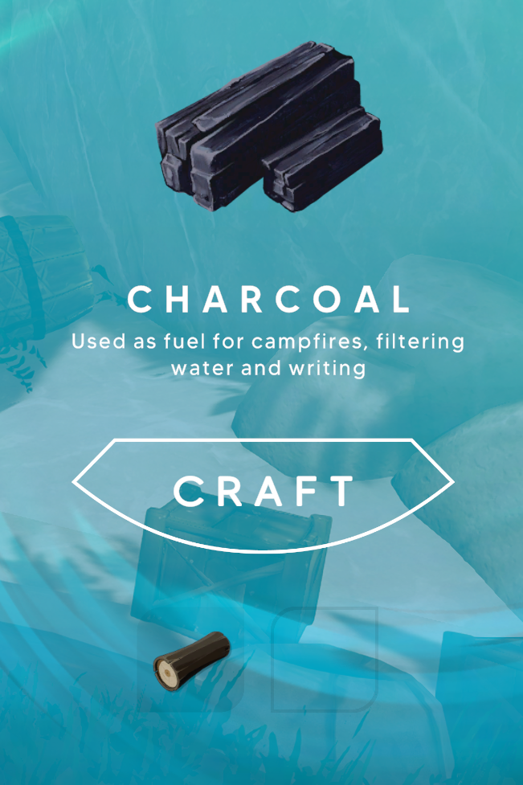

> [!IMPORTANT]  
> This repository was rehomed into the [Aloft Mods repository](https://github.com/Sessional/AloftMods) to improve the workflow experience.

# AloftModLoader
A mod loader for Aloft to facilitate content-only asset bundle mods for Aloft. AloftModLoader aims to erase the boiler plate of creating a content only and plugs content directly into Aloft dynamically at run time.

## Set up for development:

```
> mkdir Libraries
```

Copy in these files from BepInEx:

- 0Harmony.dll
- BepInEx.Core.dll
- BepInEx.Unity.Common.dll
- BepInEx.Unity.Mono.dll

From Aloft copy these files in:
- Aloft.dll
- Assembly-CSharp.dll
- UnityEngine.dll
- UnityEngine.CoreModule.dll
- UnityEngineAssetBundleModule.dll

## Installation for use:

Set up for development, build and then copy the two .dll outputs into the `BepInEx/plugins` folder.
- AloftModLoader.dll
- AloftModFramework.dll

## For Creating New Content:

- Get Unity version 2021.3.12f1 from https://unity.com/releases/editor/archive

- Install BepInEx (tested with https://github.com/BepInEx/BepInEx/releases/tag/v6.0.0-pre.2)

- Get thunderkit set up (used release 9.1.0): https://github.com/PassivePicasso/ThunderKit

- Copy the `AloftModFramework.dll` file into the Thunderkit Unity project inside `Assets`. 

- Create your thunderkit project (pipeline and manifest). Pipeline output (asset bundle locations) must output to `Aloft\Aloft_Data\StreamingAssets\amf` to be loaded automatically.

See [creating a recipe](Documentation/CreatingARecipe.md) to explore how to add a recipe to the game. Or see [more in depth documentation for setting up a project.](Documentation/README.md)

## Creating your first recipe

Our first recipe is going to be to turn Wood into Charcoal.


Right click in the asset browser and choose to create a new recipe.



Tweak the settings for the recipe to turn wood into coal:



To create this recipe, wire up `input items`, which is referencing `ItemIds`. `3` = Wood. For output choose one of the fields: `Output Vanilla Item`, `Output Item Id`, `Output Mod Item`. `Output Vanilla Item` is useful for quickly picking the item without having to research IDs. `Output Item Id` is great for hooking a new recipe into another content mods Items. `Output Mod Item` is great for referencing items created inside the same content bundle.

Launch the game and explore the new recipe!

